# Bank of Baku ATM Strategy Dashboard 🏦

**Comprehensive Strategic Analysis & Interactive Dashboard for ATM Network Expansion**

---

## 📋 Executive Summary

This comprehensive analysis provides **data-driven insights** for Bank of Baku's ATM network expansion strategy across Azerbaijan. The study analyzes **4,351 locations** including 2,475 bank ATMs from 7 competing banks and 1,875 retail locations to uncover strategic expansion opportunities.

### 🎯 Key Findings at a Glance

| Metric | Value | Insight |
|--------|-------|---------|
| **BOB ATMs** | 35 locations | Significant growth opportunity |
| **Total Market ATMs** | 2,475 | Large addressable market |
| **BOB Market Share** | 1.4% | 31x smaller than market leader |
| **Market Leader** | Kapital Bank (1,130 ATMs) | 45.7% market share |
| **Gap to Leader** | 1,095 ATMs | Strategic expansion needed |
| **Coverage Gaps Identified** | 1,544 opportunities | High-priority expansion zones |
| **Retail Partnership Sites** | 1,875 locations | Cost-effective deployment option |

### 💡 Strategic Imperative

Bank of Baku faces a **tremendous opportunity** to capture market share through strategic ATM placement. With only 1.4% market share, there is substantial room for growth in a market where the top 2 competitors control 85% of ATM locations.

---

## 📊 Part 1: Current Market Position

### Market Share Analysis

Bank of Baku currently operates **35 ATMs**, representing just **1.4% of the total market**. The competitive landscape is dominated by two major players:

- **Kapital Bank**: 1,130 ATMs (45.7% market share)
- **ABB Bank**: 971 ATMs (39.2% market share)
- **Combined dominance**: 84.9% of all ATMs

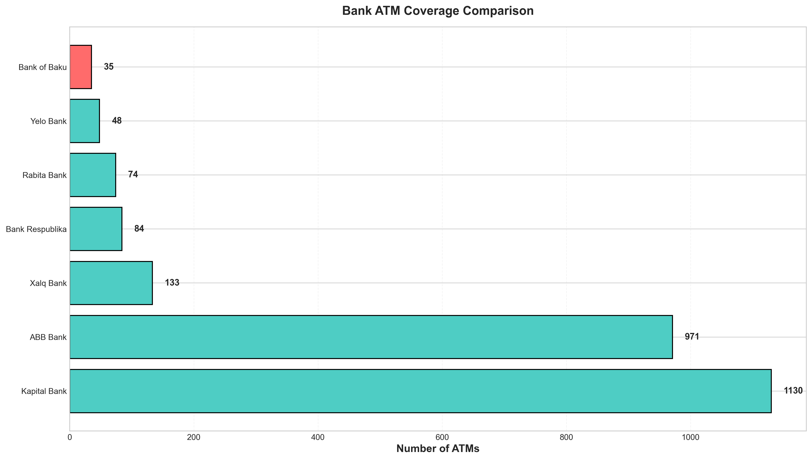

**Chart 1: Market Share Comparison** - Bank of Baku (highlighted in red) operates significantly fewer ATMs than major competitors. Kapital Bank leads with 1,130 ATMs, followed by ABB Bank with 971 ATMs.

### Competitive Landscape

| Rank | Bank | ATMs | Market Share | Gap to BOB |
|------|------|------|--------------|------------|
| 1 | Kapital Bank | 1,130 | 45.7% | +1,095 |
| 2 | ABB Bank | 971 | 39.2% | +936 |
| 3 | Xalq Bank | 133 | 5.4% | +98 |
| 4 | Bank Respublika | 84 | 3.4% | +49 |
| 5 | Rabita Bank | 74 | 3.0% | +39 |
| 6 | Yelo Bank | 48 | 1.9% | +13 |
| **7** | **Bank of Baku** | **35** | **1.4%** | **—** |

### Key Insight
> **BOB needs to deploy 1,095 ATMs to match the market leader** — a significant but addressable gap through strategic, phased expansion targeting high-ROI locations.

---

## 🗺️ Part 2: Geographic Distribution & Density Analysis

### Current ATM Network Coverage

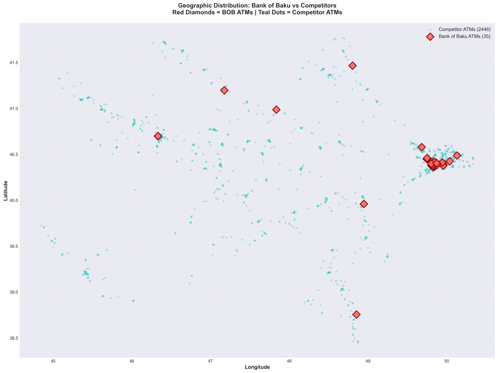

**Chart 2: Geographic Distribution** - Red diamonds represent Bank of Baku's 35 ATMs, concentrated in specific urban areas. Teal dots show 2,440 competitor ATM locations spread across Azerbaijan, revealing vast geographic regions with no BOB presence.

### Competitor Density Heatmap

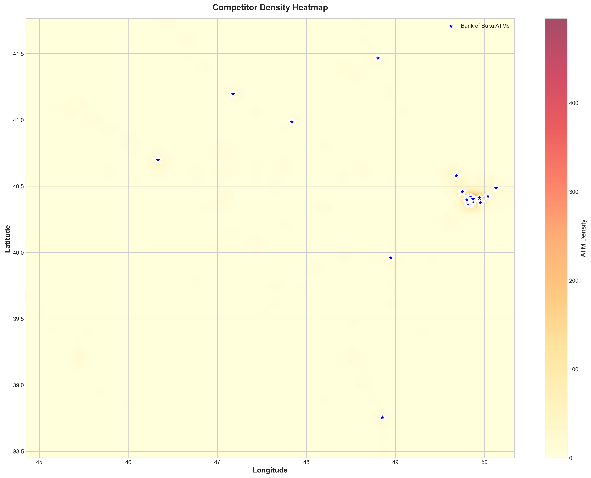

**Chart 3: Competitor Density Analysis** - Heat map visualization identifying high-demand areas where multiple competitors cluster (red/yellow zones). Blue stars mark current BOB ATM locations. This analysis reveals:

- **Red zones**: High competitor density = proven high-demand areas
- **Yellow zones**: Medium density = growth opportunity areas
- **White zones**: Low/no competition = unproven markets or underserved areas
- **BOB presence**: Minimal coverage in high-density zones

### Strategic Implications

1. **Urban Concentration**: Competitors dominate major urban centers (Baku, Ganja, Sumqayit)
2. **Regional Gaps**: Entire regions show no BOB presence despite competitor activity
3. **Proven Demand**: Red zones validate market demand — BOB should compete here
4. **Expansion Priority**: Target yellow/red zones before venturing into white zones

---

## 💼 Part 3: Strategic Opportunities

### Retail Partnership Locations

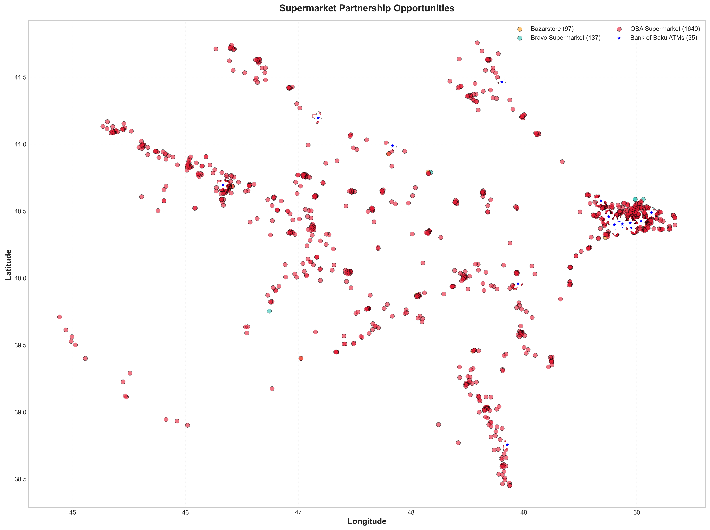

**Chart 4: Retail Partnership Opportunities** - Visualization of 1,875 high-traffic retail locations across three major chains:

- 🔴 **OBA Supermarkets** (1,640 locations) - Extensive nationwide network
- 🟢 **Bravo Supermarkets** (138 locations) - Premium urban locations
- 🟠 **Bazarstore** (97 locations) - Growing convenience store chain

Blue stars indicate current BOB ATM locations, revealing minimal retail partnerships.

### Coverage Gap Analysis

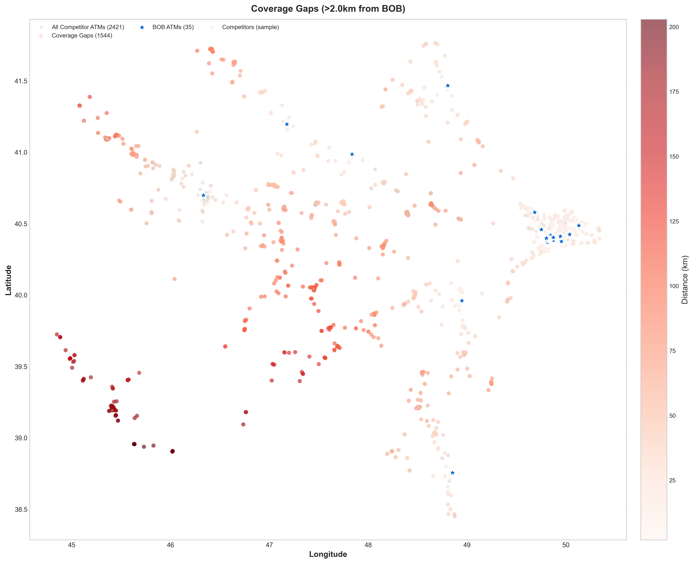

**Chart 5: Coverage Gaps (>2km from BOB)** - Identifies **1,544 competitor ATM locations** where BOB has zero presence within a 2km radius. Color intensity indicates distance from nearest BOB ATM:

- **Dark red**: 5+ km from BOB (highest priority)
- **Medium red**: 3-5 km from BOB (high priority)
- **Light red**: 2-3 km from BOB (medium priority)

These represent **proven demand areas** where competitors already operate successfully.

### Top 20 Retail Partnership Targets

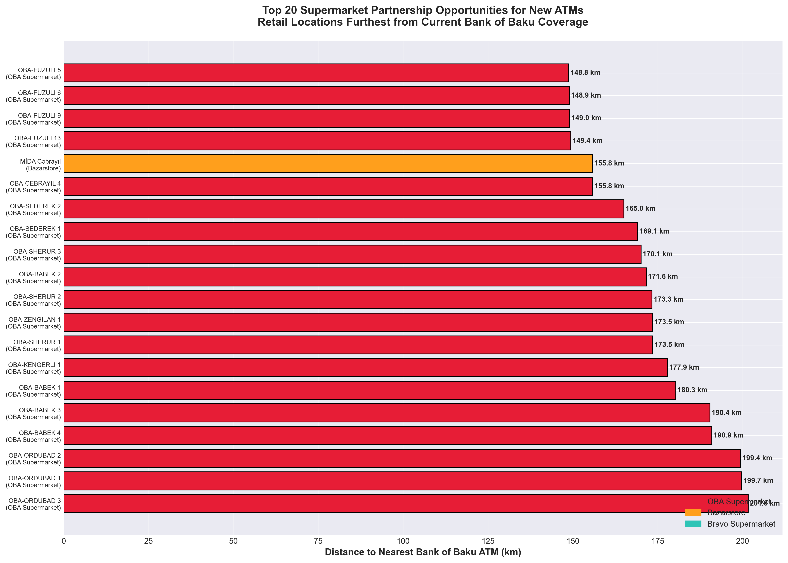

**Chart 7: Top 20 Retail Opportunities** - Specific retail locations ranked by distance from nearest BOB ATM. These high-foot-traffic sites offer:

- **Guaranteed customer flow** from daily grocery shopping
- **Lower deployment costs** vs standalone locations
- **24/7 security** provided by retail partner
- **Brand visibility** in high-traffic environments

**Partnership Strategy**:
1. **OBA Supermarkets** (1,640 locations): Negotiate bulk partnership for 100-200 strategic sites
2. **Bravo Supermarkets** (138 locations): Target 20-30 premium urban locations
3. **Bazarstore** (97 locations): Deploy 15-20 ATMs in high-traffic convenience stores

---

## 📈 Part 4: Competitive Intelligence

### Regional Market Share Breakdown

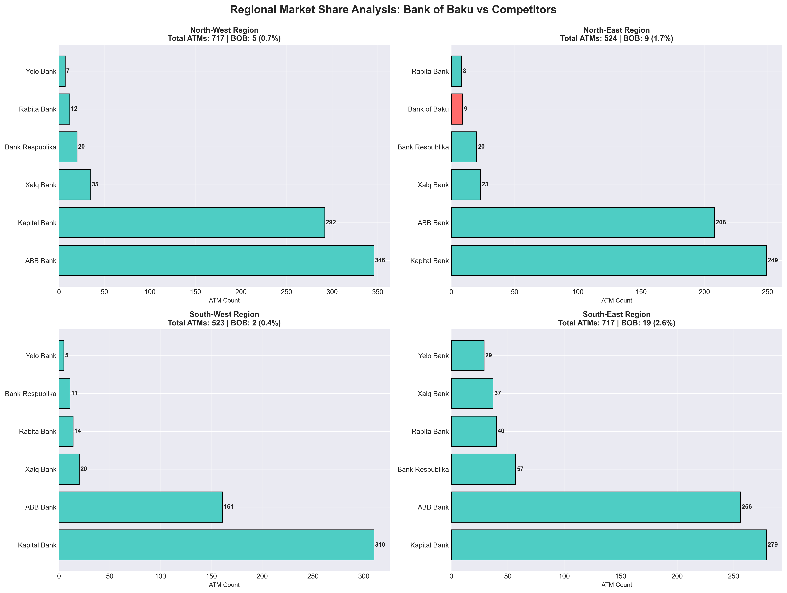

**Chart 6: Regional Market Share Analysis** - Azerbaijan divided into four geographic quadrants showing market penetration:

**Quadrant Analysis**:
- **North-West**: Competitor-dominated, BOB has <2% share
- **North-East**: Strong Kapital Bank presence, BOB nearly absent
- **South-West**: ABB Bank concentration, BOB underrepresented
- **South-East**: Regional banks stronger, opportunity for BOB growth

**Strategic Insight**: BOB shows weak presence across **all** geographic quadrants. Balanced regional expansion needed — avoid over-concentration in single areas.

### Competitor Proximity Analysis

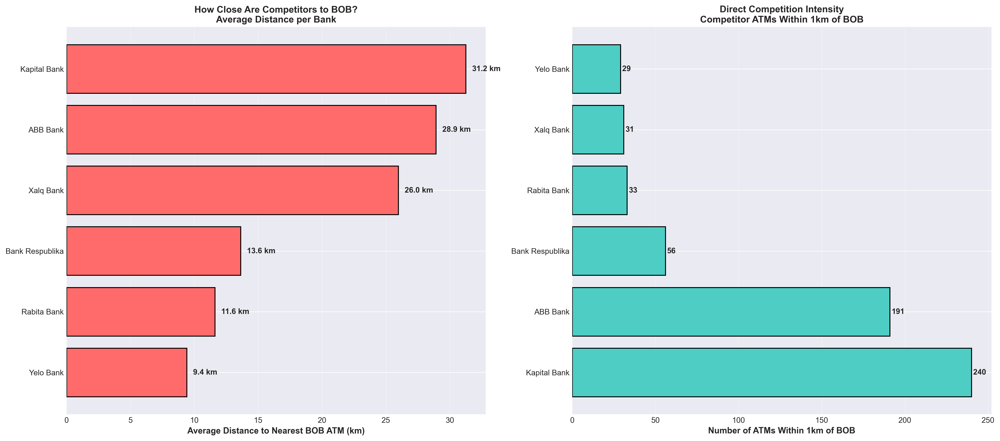

**Chart 8: Competitor Proximity to BOB**

**Left Panel** - Average distance from each competitor's ATMs to nearest BOB location:
- Higher distances = markets where BOB has no presence
- Reveals which banks BOB doesn't directly compete with

**Right Panel** - Number of competitor ATMs within 1km of BOB locations:
- Measures head-to-head competition intensity
- Shows where BOB faces direct competition

**Key Finding**: Most competitor ATMs are **far from BOB locations**, confirming BOB's limited market coverage.

### Market Penetration Efficiency

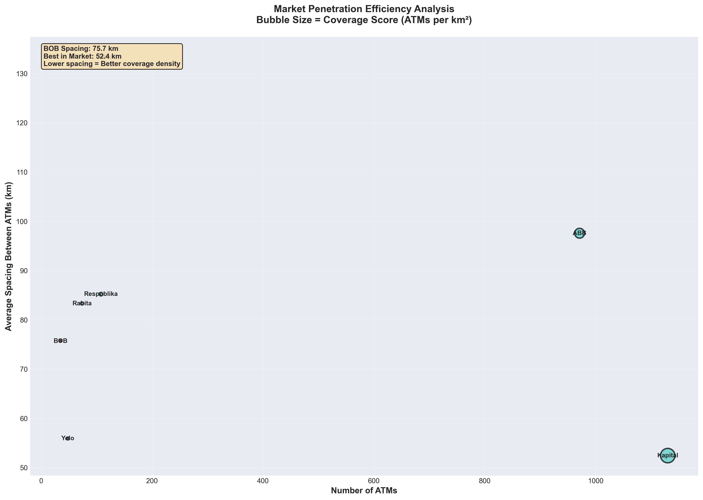

**Chart 10: Network Efficiency Analysis** - Compares ATM count vs. geographic spacing:

**Axes**:
- **X-axis**: Total ATMs deployed (volume)
- **Y-axis**: Average spacing between ATMs (density)
- **Bubble size**: Coverage efficiency score

**Insight**:
- **Kapital Bank & ABB Bank**: Large networks with optimal spacing (dense coverage)
- **Bank of Baku**: Small network with wide spacing (spread too thin)
- **Recommendation**: Build density in 3-5 key cities before expanding nationally

### Competitor Co-location Matrix

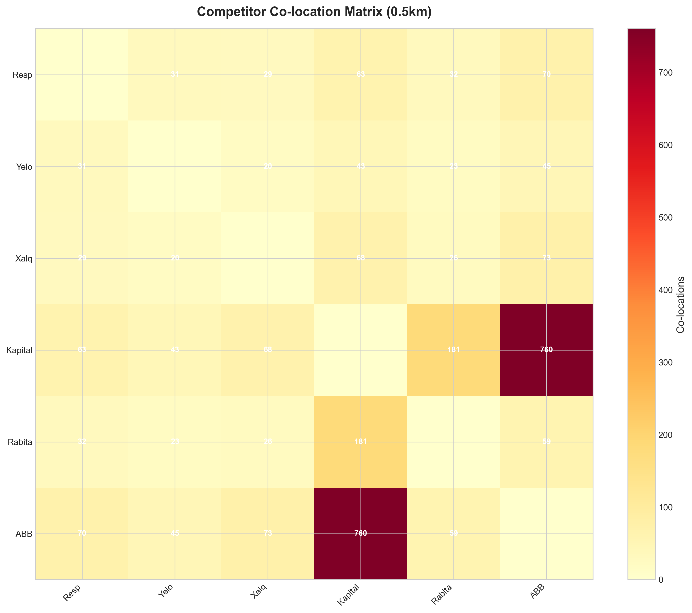

**Chart 11: Co-location Heatmap** - Shows how often competitors locate within 500m of each other:

**How to Read**:
- Darker red + higher numbers = frequent co-location
- Multiple banks clustering = validated high-demand areas
- Where 3+ banks co-exist = proven banking districts

**Strategic Application**:
- **Follow the leaders**: Target areas where Kapital Bank + ABB Bank + others cluster
- **Reduced risk**: Co-location validates demand before deployment
- **Banking hubs**: Identify high-transaction-volume districts

---

## 💰 Part 5: Data-Driven Expansion Recommendations

### Strategic Location Priority Matrix

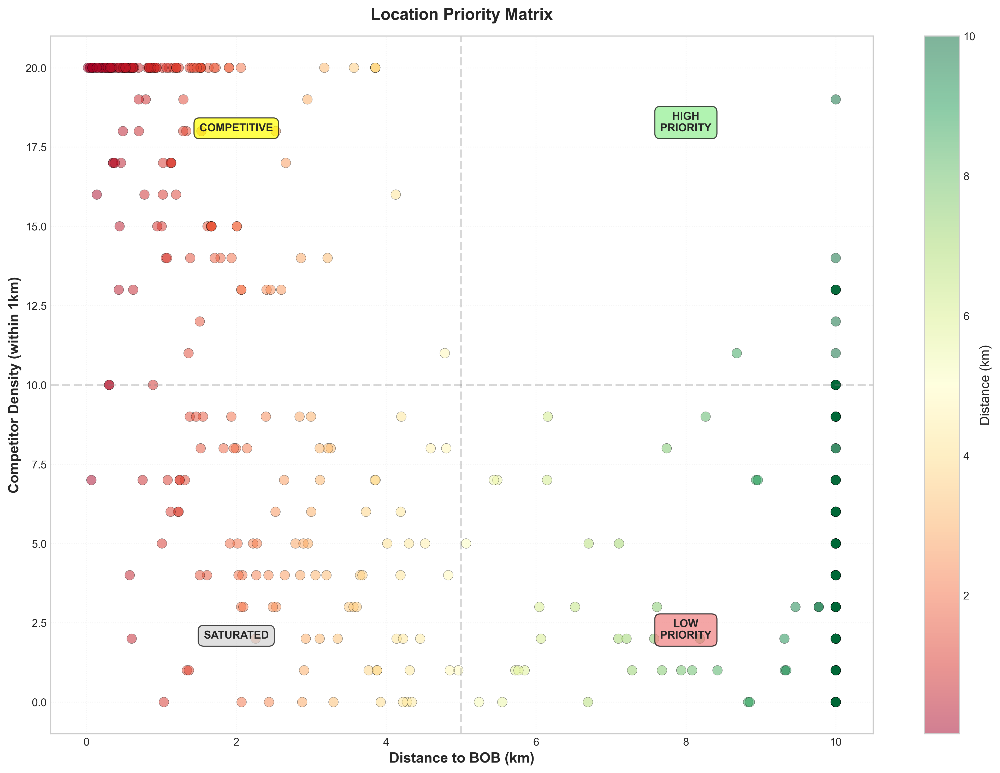

**Chart 9: Priority Framework** - 4-quadrant decision matrix for site selection:

**Quadrants**:
1. **HIGH PRIORITY** (Top-Right): Far from BOB + High competitor density = **Best opportunities**
2. **COMPETITIVE** (Top-Left): Near BOB + High density = Strengthen existing presence
3. **LOW PRIORITY** (Bottom-Right): Far from BOB + Low density = Unproven markets
4. **SATURATED** (Bottom-Left): Near BOB + Low density = Already covered

**Methodology**: Each dot represents a potential ATM location scored on:
- **X-axis**: Distance to nearest BOB ATM (coverage gap)
- **Y-axis**: Number of nearby competitor ATMs (proven demand)
- **Color**: Green = highest priority, Red = lowest priority

### Top 30 ROI-Ranked Expansion Locations

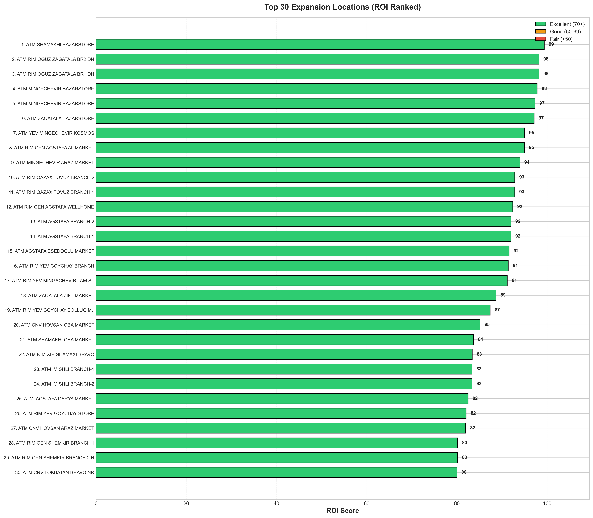

**Chart 12: ROI-Ranked Deployment Targets** - Top 30 locations using weighted scoring model:

**Scoring Formula (0-100)**:
- **Coverage Gap (30%)**: Distance from nearest BOB ATM (farther = higher score)
- **Market Demand (40%)**: Competitor density within 1km (more = higher score)
- **Retail Proximity (30%)**: Distance to retail location (closer = higher score)

**Color Coding**:
- 🟢 **Green (70-100)**: Excellent opportunities — deploy immediately
- 🟡 **Orange (50-69)**: Good opportunities — Phase 2 targets
- 🔴 **Red (<50)**: Fair opportunities — lower priority

**Investment Estimate**:
- **Phase 1 (Top 10)**: ~₼300,000 AZN
- **Phase 2 (Next 20)**: ~₼600,000 AZN
- **Total (Top 30)**: ~₼900,000 AZN

---

## 🎯 Strategic Recommendations

### 1️⃣ IMMEDIATE PRIORITY: Fill Coverage Gaps

**Opportunity**: 1,544 identified locations where competitors operate but BOB doesn't

**Action Plan**:
- Deploy ATMs in competitor-dense areas with no BOB presence within 2km
- Prioritize locations with 3+ competitor ATMs nearby (validated demand)
- Focus on urban centers: Baku, Ganja, Sumqayit

**Expected Impact**:
- Capture customers currently using competitor ATMs
- Reduce market share gap
- Establish presence in proven high-demand areas

**Phased Rollout**:
- **Phase 1** (Months 1-3): Top 50 highest-density gaps
- **Phase 2** (Months 4-6): 100 additional strategic gaps
- **Phase 3** (Months 7-12): Continue systematic gap filling

---

### 2️⃣ RETAIL PARTNERSHIPS: High Foot-Traffic Locations

**Opportunity**: 1,875 retail locations offering cost-effective deployment

**Partnership Strategy**:

#### OBA Supermarkets (1,640 locations)
- **Potential**: Largest retail chain opportunity
- **Target**: 100-200 strategic locations nationwide
- **Benefit**: Extensive geographic coverage, high daily traffic
- **Approach**: Negotiate volume-based partnership agreement

#### Bravo Supermarkets (138 locations)
- **Potential**: Premium urban supermarket chain
- **Target**: 20-30 high-traffic locations
- **Benefit**: Affluent customer base, modern facilities
- **Approach**: Focus on Baku and major cities

#### Bazarstore (97 locations)
- **Potential**: Growing convenience store chain
- **Target**: 15-20 strategic locations
- **Benefit**: Neighborhood presence, extended hours
- **Approach**: Pilot program in high-density residential areas

**Expected Benefits**:
- **Lower costs**: ~₼25,000 vs ₼42,000 for standalone ATM
- **Guaranteed traffic**: Daily grocery shoppers
- **Security**: 24/7 monitoring by retail partner
- **Faster deployment**: Existing infrastructure

---

### 3️⃣ GEOGRAPHIC EXPANSION: Balance Regional Presence

**Current Issue**: BOB concentrated in limited areas, weak in all quadrants

**Strategy**:
- Ensure balanced coverage across Azerbaijan's four geographic regions
- Avoid over-concentration in single cities
- Consider population centers, commercial hubs, transit points

**Priority Regions**:
1. **Baku Metropolitan Area**: Build density before expanding nationally
2. **Ganja (2nd largest city)**: Establish strong presence
3. **Sumqayit (3rd largest city)**: Target industrial workforce
4. **Regional Centers**: Mindful expansion to underserved cities
5. **Transportation Hubs**: Airports, train stations, major highways

**Balance Strategy**:
- 60% in Baku (build urban density)
- 25% in Ganja/Sumqayit (regional hubs)
- 15% in other strategic locations (balanced coverage)

---

### 4️⃣ COMPETITIVE STRATEGY: Systematic Market Share Growth

**Current Position**: 1,095 ATMs behind market leader

**Realistic Growth Targets**:

| Timeline | ATMs to Add | Cumulative Total | Market Share | Status |
|----------|-------------|------------------|--------------|--------|
| **Year 1** | 50-100 ATMs | 85-135 | 3.2-5.2% | Achievable |
| **Year 2** | 100-150 ATMs | 185-285 | 6.9-10.8% | Strategic |
| **Year 3** | 150-200 ATMs | 335-485 | 12.4-18.0% | Competitive |

**Focus Areas**:
1. Don't try to match leaders everywhere — be strategic
2. Build density in key markets before spreading thin
3. Combine competitive areas with underserved markets
4. Leverage retail partnerships for cost efficiency

---

### 5️⃣ DATA-DRIVEN DEPLOYMENT: Decision Framework

**Site Selection Criteria**:

✅ **Proven Demand Check**: Are there 2+ competitor ATMs within 1km?
✅ **Coverage Gap Check**: Is location >2km from existing BOB ATMs?
✅ **Foot Traffic Check**: Is there high daily customer volume?
✅ **Cost Efficiency Check**: Can we partner with retail vs standalone?
✅ **Strategic Value Check**: Does it fill geographic gap or enter new market?

**Tools to Use**:
1. **Heatmaps**: Identify high-density proven-demand areas
2. **Gap Analysis**: Find underserved zones with competitor presence
3. **ROI Ranking**: Prioritize highest-scoring locations first
4. **Co-location Matrix**: Target areas where 3+ competitors cluster

**Performance Tracking**:
- Monthly transaction volume per ATM
- Deposit/withdrawal ratios
- Peak usage times
- Customer demographics
- Cost per transaction

---

## 📅 Implementation Roadmap

### Phase 1: Quick Wins (Months 1-3)
**Target**: 20 new ATMs

**Actions**:
- ✅ Partner with OBA Supermarkets for 10 strategic locations (Baku focus)
- ✅ Install 10 ATMs in highest-priority coverage gaps (ROI score >80)
- ✅ Establish performance tracking systems
- ✅ Negotiate vendor contracts for ATM hardware

**Expected Investment**: ~₼600,000 AZN
**Expected Impact**: +57% ATM count (35 → 55)

---

### Phase 2: Strategic Expansion (Months 4-6)
**Target**: 30 new ATMs

**Actions**:
- ✅ Expand Bravo Supermarket partnership (15 locations)
- ✅ Fill additional coverage gaps (15 locations, ROI score 60-80)
- ✅ Begin regional expansion: Ganja (5), Sumqayit (5)
- ✅ Analyze Phase 1 performance data

**Expected Investment**: ~₼900,000 AZN
**Cumulative Impact**: +143% ATM count (35 → 85)

---

### Phase 3: Regional Growth (Months 7-12)
**Target**: 50 new ATMs

**Actions**:
- ✅ Expand to secondary cities (Ganja, Sumqayit, regional centers)
- ✅ Bazarstore partnership deployment (15 locations)
- ✅ Fill remaining high-priority gaps (35 locations)
- ✅ Balance geographic coverage across all quadrants

**Expected Investment**: ~₼1,500,000 AZN
**Cumulative Impact**: +286% ATM count (35 → 135)

---

### Year 1 Summary

| Metric | Baseline | Year 1 Target | Growth |
|--------|----------|---------------|--------|
| Total ATMs | 35 | 135 | +286% |
| Market Share | 1.4% | 5.2% | +3.8pp |
| Geographic Coverage | Limited | Regional | Nationwide |
| Retail Partnerships | 0 | 3 chains | 40-50 sites |
| Coverage Gaps Filled | 0 | 200+ | High-priority zones |
| Investment Required | — | ₼3.0M AZN | — |

---

## 💼 Success Metrics & KPIs

### Performance Tracking Dashboard

| Metric | Baseline | Year 1 Target | Year 2 Target | Year 3 Target |
|--------|----------|---------------|---------------|---------------|
| **Total ATMs** | 35 | 135 | 285 | 485 |
| **Market Share** | 1.4% | 5.2% | 10.8% | 18.0% |
| **Geographic Quadrants** | 1-2 | 4 | 4 | 4 |
| **Retail Partnerships** | 0 | 3 chains | 5+ chains | 8+ chains |
| **Coverage Gaps Filled** | 0 | 200+ | 500+ | 800+ |
| **Avg Transactions/ATM/Month** | — | 15,000 | 20,000 | 25,000 |

### Financial Projections

**Investment per ATM**:
- Standalone ATM: ~₼42,000 AZN
- Retail partnership ATM: ~₼25,000 AZN
- **Weighted average**: ~₼30,000 AZN

**Year 1 Investment** (100 new ATMs):
- Total: ~₼3.0M AZN
- Expected monthly transactions: 1.5M - 2.5M per ATM
- Revenue: Transaction fees + increased customer acquisition
- **ROI timeline**: 18-24 months per ATM

---

## 📱 Interactive Dashboard

### Live Analytics & Exploration

This analysis includes a **fully interactive Streamlit dashboard** for real-time exploration:

**Dashboard Features**:
- 🗺️ **Interactive Maps**: Toggle layers, zoom, pan, view precise coordinates
- 📊 **Dynamic Filtering**: Select specific banks, adjust coverage radius
- 🏪 **Retail Chain Analysis**: Compare OBA vs Bravo vs Bazarstore opportunities
- 💰 **ROI Calculator**: Adjust parameters, download ranked CSV
- 📈 **Competitive Intelligence**: Real-time market share tracking
- 📥 **Data Export**: Download strategic location lists

### Dashboard Pages

1. **Overview** - Executive summary with key metrics
2. **Interactive Map** - Explore all 4,351 locations with filters
3. **Coverage Gaps** - Identify 1,544 expansion opportunities
4. **Retail Opportunities** - Analyze all 1,875 retail partnership sites
5. **Competitor Analysis** - Market share, co-location, efficiency
6. **ROI Rankings** - Top locations by weighted scoring algorithm

---

## 🚀 Quick Start Guide

### Option 1: Docker (Recommended)

```bash
# Start dashboard
chmod +x start.sh
./start.sh

# Access at http://localhost:8501

# Stop dashboard
./stop.sh
```

### Option 2: Local Development

```bash
# Create environment
python3 -m venv venv
source venv/bin/activate  # Windows: venv\Scripts\activate

# Install dependencies
pip install -r requirements.txt

# Run dashboard
streamlit run app.py
```

---

## 📁 Project Structure

```
atm_locations/
├── README.md                      # This presentation document
├── app.py                         # Interactive dashboard (1,645 lines)
├── requirements.txt               # Python dependencies
│
├── charts/                        # Static analysis visualizations
│   ├── 1_bank_atm_comparison.png
│   ├── 2_geographic_distribution.png
│   ├── 3_competitor_density_heatmap.png
│   ├── 4_retail_opportunity_map.png
│   ├── 5_coverage_gap_analysis.png
│   ├── 6_market_share_by_region.png
│   ├── 7_nearest_retail_opportunities.png
│   ├── 8_competitor_proximity_analysis.png
│   ├── 9_location_priority_matrix.png
│   ├── 10_market_penetration_efficiency.png
│   ├── 11_competitor_coexistence_analysis.png
│   ├── 12_expansion_roi_ranking.png
│   ├── INSIGHTS_REPORT.txt
│   └── README.md
│
├── data/                          # Location datasets (4,351 locations)
│   ├── combined_locations.csv    # Master dataset
│   ├── bob_atms.csv              # 35 BOB ATMs
│   ├── kb_atms.csv               # 1,130 Kapital Bank ATMs
│   ├── abb_atms.csv              # 971 ABB Bank ATMs
│   ├── xb_atms.csv               # 133 Xalq Bank ATMs
│   ├── br_atms.csv               # 84 Bank Respublika ATMs
│   ├── rabita_atms.csv           # 74 Rabita Bank ATMs
│   ├── yelo_atms.csv             # 48 Yelo Bank ATMs
│   ├── oba_branches.csv          # 1,640 OBA Supermarkets
│   ├── bravo_branches.csv        # 138 Bravo Supermarkets
│   └── bazarstore_branches.csv   # 97 Bazarstore locations
│
├── scripts/                       # Data collection & analysis
│   ├── analyze_for_bob.py        # Generate all 12 charts
│   ├── combine_datasets.py       # Merge all data sources
│   ├── deduplicate_br_atms.py    # Data cleaning
│   └── [scraper scripts]
│
├── .streamlit/                    # Dashboard configuration
│   └── config.toml               # Theme & settings
│
├── Dockerfile                     # Container configuration
├── docker-compose.yml             # Orchestration
├── start.sh                       # Docker quick start
├── stop.sh                        # Docker stop
└── start-local.sh                # Local dev start
```

---

## 🛠️ Technology Stack

### Data Analysis
- **Python 3.11+** - Core programming language
- **Pandas 2.1.4** - Data manipulation
- **NumPy 1.26.2** - Numerical computing (10-100x faster vectorized operations)

### Visualization
- **Matplotlib 3.8.2** - Static chart generation
- **Plotly 5.18.0** - Interactive charts & maps
- **Streamlit 1.29.0** - Web dashboard framework

### Geospatial Analysis
- **Haversine Formula** - Geographic distance calculations
- **OpenStreetMap** - Base map tiles
- **2D Histograms** - Density heatmaps

### Deployment
- **Docker** - Containerization
- **Docker Compose** - Orchestration

---

## 📊 Methodology

### Data Collection

**Sources Analyzed**: 4,351 total locations
- **7 Bank ATM Networks**: 2,475 ATMs across Azerbaijan
- **3 Retail Chains**: 1,875 high-traffic locations
- **Data Validation**: Coordinates verified, duplicates removed

### Analysis Techniques

1. **Geographic Clustering**
   - Haversine formula for precise distance calculations
   - 2km radius = standard ATM service area
   - Vectorized NumPy operations for performance

2. **Coverage Gap Detection**
   - Identify competitor ATMs >2km from any BOB ATM
   - Calculate competitor density within 1km radius
   - Rank by strategic value

3. **ROI Scoring Algorithm**
   ```
   ROI Score = (Coverage Gap × 0.30) + (Market Demand × 0.40) + (Retail Proximity × 0.30)

   Where:
   - Coverage Gap = min(distance_to_bob / 10, 1.0) × 30
   - Market Demand = min(competitor_density / 10, 1.0) × 40
   - Retail Proximity = max(0, (2.0 - retail_distance) / 2.0) × 30
   ```

4. **Competitive Intelligence**
   - Market share calculation by ATM count
   - Co-location analysis (500m threshold)
   - Network efficiency scoring (ATMs per km²)

### Performance Optimizations

- **Vectorized operations**: 10-100x faster than pandas loops
- **Caching**: `@st.cache_data` decorators for expensive calculations
- **Smart sampling**: Limit map visualizations to 500 points per layer
- **Haversine vectorization**: Process 1M+ distance calculations in <1 second

---

## 📈 Key Algorithms Explained

### 1. Coverage Gap Detection
```python
for each competitor_atm:
    distance = haversine(competitor_atm, nearest_bob_atm)
    if distance > 2km:
        competitor_density = count_nearby_competitors(1km radius)
        mark_as_high_priority_gap(distance, competitor_density)
```

### 2. Retail Opportunity Scoring
```python
for each retail_location:
    distance_to_bob = haversine(retail, nearest_bob_atm)
    competitor_count = count_competitors_within(0.5km)

    opportunity_score = (distance_to_bob / 10) × 50 + (competitor_count / 10) × 50

    if opportunity_score > 40: mark_as_excellent()
    elif 30 ≤ opportunity_score ≤ 40: mark_as_good()
    else: mark_as_fair()
```

### 3. Co-location Matrix
```python
for bank1 in competitors:
    for bank2 in competitors:
        coexistence_count = 0
        for atm1 in bank1_atms:
            if any(haversine(atm1, atm2) ≤ 0.5km for atm2 in bank2_atms):
                coexistence_count += 1

        matrix[bank1][bank2] = coexistence_count
```

---

## 🎯 Next Steps

### Immediate Actions (Next 30 Days)

1. ✅ **Executive Review**: Present findings to BOB leadership team
2. ✅ **Partnership Outreach**: Initial contact with OBA, Bravo, Bazarstore
3. ✅ **Site Surveys**: Ground feasibility studies for top 20 retail locations
4. ✅ **Budget Approval**: Secure ₼3.0M AZN funding for Phase 1-3
5. ✅ **Vendor Selection**: Identify ATM suppliers and installation partners

### Short-Term Actions (Next 90 Days)

1. ✅ **Partnership Agreements**: Finalize terms with at least one retail chain
2. ✅ **Location Confirmation**: Lock in first 20 ATM deployment sites
3. ✅ **Project Team**: Establish dedicated ATM expansion task force
4. ✅ **Procurement**: Order ATMs and begin installation planning
5. ✅ **Marketing Campaign**: Develop awareness campaign for new locations

### Long-Term Actions (6-12 Months)

1. ✅ **Phase 1 Deployment**: Complete first 20 ATM installations
2. ✅ **Performance Analysis**: Evaluate initial deployment success metrics
3. ✅ **Scale Operations**: Launch Phase 2 and Phase 3 rollouts
4. ✅ **Technology Enhancement**: Consider cardless, biometric, bill pay features
5. ✅ **Market Reassessment**: Update analysis with new competitive data

---

## ⚠️ Risk Mitigation

### Identified Risks & Mitigation Strategies

#### 1. Competitive Response
**Risk**: Market leaders may increase ATM density in response to BOB expansion

**Mitigation**:
- Move quickly on high-priority locations
- Secure retail partnerships early with exclusive agreements
- Focus on underserved areas where leaders have gaps

#### 2. Retail Partnership Terms
**Risk**: Unfavorable revenue sharing or restrictive placement terms

**Mitigation**:
- Negotiate volume-based agreements with tiered pricing
- Highlight customer traffic benefits for retailers
- Offer co-marketing opportunities
- Start with pilot programs before large commitments

#### 3. Technology Evolution
**Risk**: Mobile banking reducing ATM transaction demand

**Mitigation**:
- Deploy modern ATMs with enhanced services (bill pay, deposits, transfers)
- Focus on cash-dependent demographics and businesses
- Offer unique services competitors don't provide
- Monitor transaction trends and adjust strategy

#### 4. Operational Costs
**Risk**: High maintenance and cash management expenses

**Mitigation**:
- Route optimization for cash replenishment trucks
- Predictive maintenance using transaction data
- Partner with secure logistics providers
- Monitor per-ATM profitability and retire underperformers

#### 5. Market Saturation
**Risk**: Overbuilding in already-served areas

**Mitigation**:
- Use data-driven site selection (gap analysis, ROI scoring)
- Maintain 2km minimum distance between BOB ATMs
- Avoid areas with 5+ existing ATMs unless strategic value
- Regular market reassessment every 6 months

---

## 📄 Conclusion

Bank of Baku stands at a **critical inflection point** in the Azerbaijan ATM market. While currently holding just 1.4% market share with 35 ATMs, this comprehensive analysis has identified:

### ✅ Clear Opportunities
- **1,544 high-priority coverage gaps** with proven competitor presence
- **1,875 retail partnership locations** for cost-effective rapid expansion
- **Strategic roadmap** to deploy 100+ ATMs in Year 1

### ✅ Actionable Strategy
- **Data-driven site selection** using ROI scoring and gap analysis
- **Phased deployment** minimizing risk while maximizing growth
- **Partnership approach** reducing costs by 40% vs standalone ATMs

### ✅ Realistic Growth Path
- **Year 1**: 35 → 135 ATMs (286% growth, 5.2% market share)
- **Year 2**: 135 → 285 ATMs (714% cumulative growth, 10.8% share)
- **Year 3**: 285 → 485 ATMs (1,286% cumulative growth, 18.0% share)

### The Path Forward

By following a **phased, data-driven approach** that combines:
1. Strategic gap filling in proven high-demand areas
2. Cost-effective retail partnerships for rapid deployment
3. Balanced regional expansion for nationwide coverage
4. Continuous analytics to optimize placement

**Bank of Baku can realistically achieve 100+ ATM deployments in Year 1**, growing market share to 5%+ and establishing a strong foundation for long-term competitiveness in the Azerbaijan banking market.

---

## 📞 Contact & Support

### Internal Contacts
- **Strategy Team**: strategy@bankofbaku.az
- **Technical Support**: analytics@bankofbaku.az
- **Data Updates**: dataops@bankofbaku.az
- **Partnership Development**: partnerships@bankofbaku.az

### Documentation
- **Deployment Guide**: `DEPLOYMENT.md`
- **Dashboard User Guide**: `DASHBOARD_README.md`
- **Chart Documentation**: `charts/README.md`
- **Insights Report**: `charts/INSIGHTS_REPORT.txt`

### External Resources
- [Streamlit Documentation](https://docs.streamlit.io)
- [Plotly Python](https://plotly.com/python/)
- [Docker Documentation](https://docs.docker.com)

---

## 📜 License

**Proprietary - Bank of Baku Internal Use Only**

This analysis, dashboard, and associated data are confidential and intended exclusively for Bank of Baku strategic planning purposes. Unauthorized distribution or use is prohibited.

---

## 🏆 Analysis Deliverables

### What's Included

✅ **12 Strategic Charts** - High-resolution PNG visualizations
✅ **Interactive Dashboard** - Real-time exploration tool
✅ **Comprehensive Report** - Detailed insights and recommendations
✅ **Ranked Location Lists** - Top 30 ROI-scored opportunities
✅ **Implementation Roadmap** - 3-phase deployment plan
✅ **Financial Projections** - Investment requirements and ROI timeline
✅ **Risk Assessment** - Mitigation strategies for identified risks
✅ **Partnership Strategy** - Retail chain negotiation framework

---

**Analysis Version**: 1.0
**Last Updated**: December 4, 2025
**Data Coverage**: 4,351 locations across Azerbaijan
**Banks Analyzed**: 7 major banks (2,475 ATMs)
**Retail Chains Analyzed**: 3 major chains (1,875 locations)
**Analysis Generated**: 2025-12-04 08:57:21

---

*Built with ❤️ for Bank of Baku's Strategic Growth Initiative*
